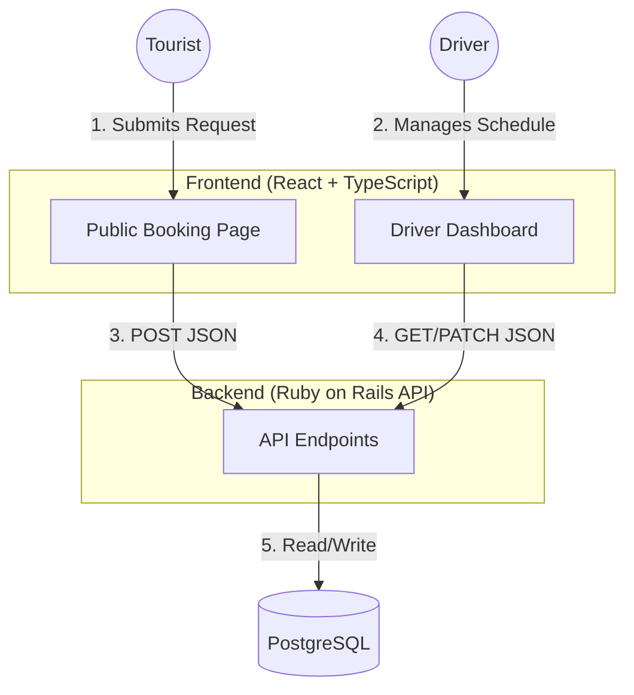

# System Design (MVP)

## Architecture Overview

The system follows a standard Client-Server architecture using a RESTful API.

- **Frontend (Client)**: Single Page Application (SPA) using React + TypeScript.
  - **Public Portal**: Booking form for tourists.
  - **Driver Dashboard**: Admin panel for managing schedule and requests.
- **Backend (Server)**: Ruby on Rails (API Mode).
- **Database**: PostgreSQL.

## Database Schema (Core Models)

### Users (Drivers)
- Authentication details (Email, Password).
- Profile (Name, Vehicle details).

### Bookings
- **Customer Info**: Name, Contact (Line/WhatsApp).
- **Type**: `airport_transfer` vs `hourly_tour`.
- **Logistics**: Pickup time, Location, Flight Number (if airport), Duration (if tour).
- **Status**: `pending`, `confirmed`, `cancelled`.

## Key API Endpoints

- `POST /api/bookings`: Submit a new booking (Public).
- `POST /api/login`: Driver authentication.
- `GET /api/admin/bookings`: View schedule (Protected).
- `PATCH /api/admin/bookings/:id`: Update status (Protected).

## Visual Architecture

Below is a Mermaid diagram representing the system flow. You can view this in VS Code or paste the code into Draw.io.

